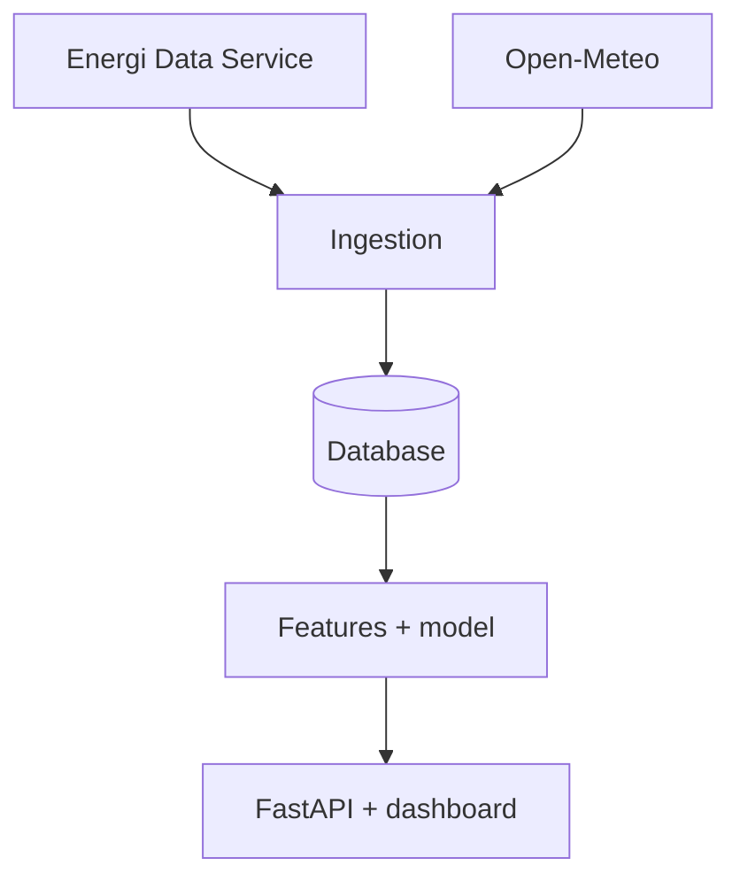

# El-pris forecast

Forudsiger danske elspotpriser 2-7 dage frem ud fra historiske priser
og vejrudsigter (vind & sol). Bygget som et end-to-end data/ML-projekt.

## Status
🚧 Under udvikling

## Arkitektur

## Teknologier
Python, pandas, LightGBM, FastAPI, Docker

## Sådan kører du det
(kommer)